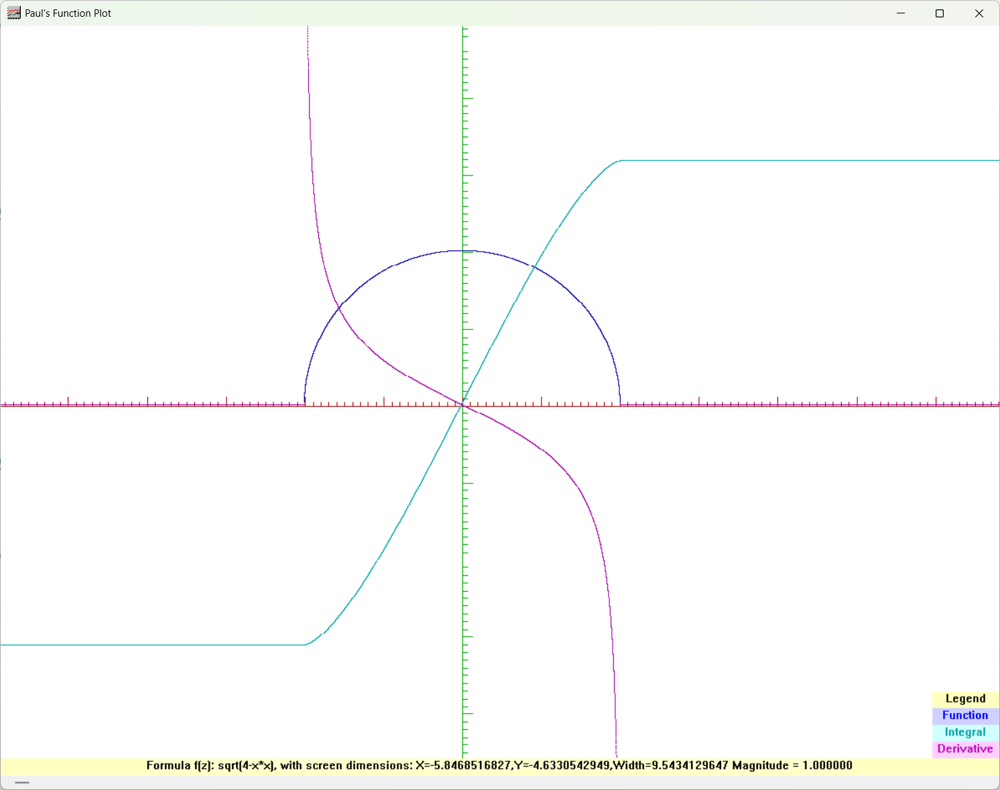

# CurvePlot

*A lightweight Windows application for exploring mathematical functions visually.*

Enter almost any mathematical expression and instantly display its graph. CurvePlot can also calculate and display the function's first derivative and indefinite integral, while allowing you to zoom and pan to investigate interesting features in detail.



---

## Features

- Fast mathematical expression parser
- Plot arbitrary mathematical functions
- Display first derivatives
- Display indefinite integrals
- Interactive zooming and panning
- Adjustable image size
- Built-in sample library
- Copy graphs directly to the Windows clipboard
- Native Win32 application (no MFC)

---

Examples include:

- Polynomial functions
- Trigonometric functions
- Hyperbolic functions
- Exponential and logarithmic functions
- Fourier series
- Square waves
- Sawtooth waves
- Triangle waves
- Impulse trains

---

## Example Formulae

```text
sin(x)
cos(x)
exp(x)
sqrt(4-x*x)
x^1.5
sin(x*pi)
sin(x)+sin(3*x)/3+sin(5*x)/5+...

```
## Explore Mathematics

CurvePlot isn't just a graphing calculator. You can zoom in and out to investigate the behaviour of functions at different scales, making it useful for studying limits, turning points, discontinuities, asymptotes, derivatives and integrals.

---

## Building

CurvePlot is built with Visual Studio 2017 Community Edition.

Requirements:

- Windows 10 or later
- Visual Studio 2017 or newer

Simply open the solution and build either:

- Debug x64
- Release x64

CurvePlot has no external library dependencies.

---

## Project Structure

```
CurvePlot/
│
├── src/            Application source
├── parser/         Mathematical expression parser
├── docs/           Documentation
└── x64/            Build output
```

---

## History

CurvePlot began as a lightweight graphing program written by Paul the LionHeart.

The mathematical expression parser is based on the original Fractint parser written by Mark C. Peterson and incorporates later work by Chuck Ebbert, Tim Wegner, and others. The parser has been adapted and modernised for use within CurvePlot.

Originally written as a personal mathematical exploration tool, CurvePlot has been modernised for today's 64-bit Windows systems while preserving the speed and simplicity of the original application.

---

## License

Copyright © 1997–2026 Paul de Leeuw.

The parser retains the original Fractint copyright notice where applicable.

---

## Future Plans

- CMake build system
- Multiple graph support
- Anti-aliased rendering
- Mouse wheel zoom
- SVG export
- Improved documentation
- Additional mathematical functions

---

## Credits

**Paul the LionHeart**  
Author, Developer, and Relentless Dragon Tamer

**The Fractint Team**  
For the original mathematical expression parser that inspired and powered CurvePlot for decades.

**ChatGPT**  
Workshop Assistant, Reviewer, Teacher, Sounding Board, and Enthusiastic Dragon Spotter

*"Fun, beauty and passion."*